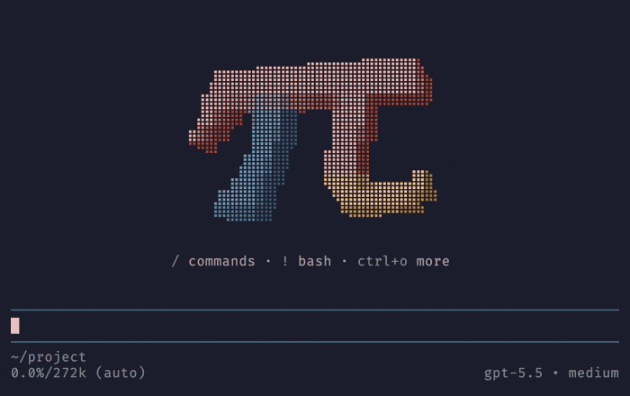

# 🌈 pi-splash

A [Pi](https://pi.dev) extension that greets you with a custom splash screen on
startup: a slowly turning 3D π in the colors of the pi logo, centered in your
terminal.



## 🚀 Installation

```sh
pi install npm:pi-splash
```

If you previously installed `pi-banner`, replace it to avoid loading both
extensions:

```sh
pi remove npm:pi-banner
pi install npm:pi-splash
```

## ✨ Usage

- Greets you with a 3D π every time pi starts, a small but non-negotiable
  improvement to your day: a lit slab drawn in braille dots that slowly turns
  around
- Centers the splash screen in the terminal in fullscreen mode
- Keeps a usage overview under it: the key hints from pi's own header that are
  specific to pi, in your theme's colors and with your keybindings
- Switches to the `plain` mode for the number nerds: the digits of π, laid out
  as the π
- Restores pi's usual startup screen when you remove or disable the extension,
  no hard feelings

## 🎛️ Tuning

Change the splash screen at any time with `/splash`. Changes apply immediately and are
saved for the next session.

| Command                 | Effect                                                                                                  |
| ----------------------- | ------------------------------------------------------------------------------------------------------- |
| `/splash`               | Show the current settings                                                                               |
| `/splash 3d` / `plain`  | Switch between the 3D slab (default) and the digits of π                                                |
| `/splash color <value>` | Paint the π: `pi` (default), `rainbow`, `sunset`, `ocean`, `fire`, `mono`, or hex colors                |
| `/splash size <n>`      | Size of the 3D π, from `0.5` to `2` times the default (default `1`); it shrinks to fit a small terminal |
| `/splash thickness <n>` | Depth of the 3D slab, from `0.5` to `20` block widths (default `8`)                                     |
| `/splash speed <n>`     | Turns per minute, from `0` to `60`; `0` keeps the π still (default `10`)                                |
| `/splash reset`         | Restore the defaults                                                                                    |

Colors can be a preset or hex colors. One hex color paints the whole π, and
several blend along its diagonal:

```text
/splash color #ff8800
/splash color #ff0000,#00ffff
```

The `pi` preset uses the colors of the pi logo. Size, thickness, and speed
only affect the 3D mode; color applies to both modes.

To get the original rainbow digits:

```text
/splash plain
/splash color rainbow
```

## 🧭 Key hints

Under the π, the splash screen shows the key hints from pi's own startup header
that are specific to pi, such as `/` for commands and `!` for bash. They use
your keybindings and your theme's colors, and they skip the keys that every
terminal user knows, such as `esc` to interrupt or `ctrl+c` to exit.

Press `ctrl+o`, or whatever you bound to expanding tool output, to expand them
into a longer list, just like in pi's header. Like that header, they follow pi's
`quietStartup` setting: set it to `true` to hide them.

## ⚙️ Configuration

The settings live in `~/.pi/agent/splash.json`, which `/splash` writes for you.
You can also edit it by hand, and pi picks it up on the next session start:

```json
{
  "mode": "plain",
  "color": "rainbow"
}
```

Only settings that differ from the defaults are saved. The file is validated
strictly: an unknown key or invalid value falls back to the defaults and shows a
warning.

## 👀 Preview

The `plain` mode: ascii art that makes `neofetch` users wish they'd thought of
it first:

```text
       3.141592653589793238462643383279
      5028841971693993751058209749445923
     07816406286208998628034825342117067
     9821    48086         5132
    823      06647        09384
   46        09550        58223
             1725         3594
            08128        48111
           74502         84102
          70193          85211        05
        5596446           22948954930381
       9644288             10975665933
```

## 🧹 Uninstall

```sh
pi remove npm:pi-splash
```

## 📄 License

[MIT](LICENSE)
