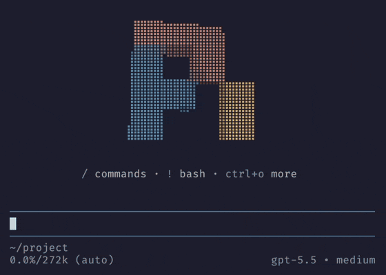

# 🌈 pi-splash

A [Pi](https://pi.dev) extension that greets you with a custom splash screen on
startup: a slowly turning 3D Pi logo in its original colors, centered in your
terminal. Prefer the mathematical π? You can choose that too.

| Mathematical π · `ocean` | Pi logo · original colors (default) |
| :---: | :---: |
|  |  |

## 🚀 Installation

```sh
pi install npm:pi-splash
```

## ✨ Usage

- Greets you with the 3D Pi logo every time pi starts, a small but non-negotiable
  improvement to your day: a lit slab drawn in braille dots that slowly turns
  around
- Centers the splash screen in the terminal in fullscreen mode
- Keeps a usage overview under it: the key hints from pi's own header that are
  specific to pi, in your theme's colors and with your keybindings
- Can start every session in a different color scheme, if you turn on `random`
  and like a little surprise with your coffee
- Uses the pixel Pi logo from its 1.0 Easter egg by default, with the
  mathematical π available as an alternative
- Switches to the `plain` mode for flat art: the digits of π, laid out as the
  π, or the Pi logo drawn in blocks
- Restores pi's usual startup screen when you remove or disable the extension,
  no hard feelings

## 🎛️ Tuning

Change the splash screen at any time with `/splash`. Changes apply immediately and are
saved for the next session.

| Command                     | Effect                                                                                                  |
| --------------------------- | ------------------------------------------------------------------------------------------------------- |
| `/splash`                   | Show the current settings                                                                               |
| `/splash 3d` / `plain`       | Switch between 3D (default) and flat art                                                                 |
| `/splash symbol pi` / `logo` | Choose the mathematical π or the Pi pixel logo (default)                                                  |
| `/splash color <value>`      | Paint the symbol: `pi` (default), `rainbow`, `sunset`, `ocean`, `fire`, `mono`, or hex colors                 |
| `/splash random on` / `off`  | Start every session with a random color scheme instead of your color (default `off`)                      |
| `/splash size <n>`           | Size of the 3D symbol, from `0.5` to `2` times the default (default `1`); it shrinks to fit a small terminal |
| `/splash thickness <n>`      | Depth of the 3D symbol, from `0.5` to `20` (default `8`)                                                    |
| `/splash speed <n>`          | Turns per minute, from `0` to `60`; `0` keeps the symbol still (default `10`)                               |
| `/splash reset`              | Restore the defaults                                                                                    |

Choose the mathematical π without changing your mode, colors, or rotation settings:

```text
/splash symbol pi
```

The 3D logo uses the pixel blocks and lighting from Pi's 1.0 Easter egg.
It rotates in place; the fullscreen dissolve, sliding puzzle, and starfield stay
in the Easter egg. Switch back to the logo with `/splash symbol logo`.

Colors can be a preset or hex colors. One hex color paints the whole symbol, and
several blend along its diagonal:

```text
/splash color #ff8800
/splash color #ff0000,#00ffff
```

The `pi` preset uses the colors of the Pi logo: with `symbol logo`, each pixel
keeps its original coral, blue, or yellow. Size, thickness, and speed only affect
the 3D mode; symbol and color apply to both modes. For the mathematical π,
`thickness` is measured in block widths. For the logo, `8` keeps the original
Easter egg's proportions, and other values scale its depth proportionally.

With `/splash random on`, every session starts with a preset picked at random
(`pi`, `rainbow`, `sunset`, `ocean`, `fire`, or `mono`), and turning it on picks
one right away. The pick only lasts for the session: your saved color stays as
it is and comes back when you turn `random` off. Choosing a color with
`/splash color` ends the pick for the current session, and `/splash random on`
shuffles again.

To get the original rainbow digits:

```text
/splash symbol pi
/splash plain
/splash color rainbow
```

## 🧭 Key hints

Under the symbol, the splash screen shows the key hints from pi's own startup header
that are specific to pi, such as `/` for commands and `!` for bash. They use
your keybindings and your theme's colors, and they skip the keys that every
terminal user knows, such as `esc` to interrupt or `ctrl+c` to exit.

Press `ctrl+o`, or whatever you bound to expanding tool output, to expand them
into a longer list, just like in pi's header. Like that header, they follow pi's
`quietStartup` setting: set it to `true` to hide them.

## ⚙️ Configuration

The settings live in `~/.pi/agent/splash.json`, which `/splash` writes for you.
You can also edit it by hand, and pi picks it up on the next session start:

```json
{
  "mode": "plain",
  "symbol": "pi",
  "color": "rainbow"
}
```

Set `"symbol": "logo"` to show the Pi logo, or `"symbol": "pi"` for the
mathematical π. Settings without `symbol`, including existing files, use the
Pi logo. An explicitly saved symbol stays selected.

Set `"random": true` to start every session with a random color scheme; `color`
then only applies when you turn `random` off.

Only settings that differ from the defaults are saved. The file is validated
strictly: an unknown key or invalid value falls back to the defaults and shows a
warning.

## 👀 Preview

The mathematical π in `plain` mode: ascii art that makes `neofetch` users wish
they'd thought of it first:

```text
       3.141592653589793238462643383279
      5028841971693993751058209749445923
     07816406286208998628034825342117067
     9821    48086         5132
    823      06647        09384
   46        09550        58223
             1725         3594
            08128        48111
           74502         84102
          70193          85211        05
        5596446           22948954930381
       9644288             10975665933
```

## 🧹 Uninstall

```sh
pi remove npm:pi-splash
```

## 📄 License

[MIT](LICENSE)
